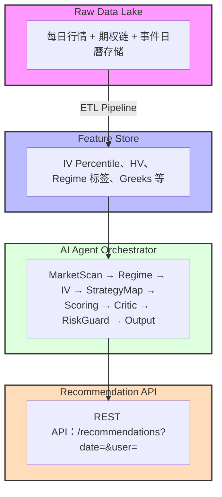

# AI 期权智投平台|产品设计⽂档

定位:为专业期权交易者打造的 AI 驱动策略推荐与风险管理平台

版本:v1.0 设计稿|2026-03

免责声明:本平台定位为「教育 + 风险管理⼯具 + 策略⽣成器」,所有输出不构成投资建议,均附风险提⽰。

## ⽬录

1. 产品愿景与定位

2. ⽤户画像

3. 核⼼功能架构

4. AI Multi-Agent 系统设计

5. 介⾯设计规格

6. 策略库设计

7. AI 推荐引擎

8. 综合评分体系

9. 风险管理与强制约束

10. 数据架构

11. 版本规划

## 12. KPI 指标

## 1. 产品愿景与定位

### 1.1 核⼼洞察

基于对期权⾼⼿策略的研究(巫天华、33Tiger、胡⼣等),盈利的本质在于:

在正确的市场环境下,选择具备 Greeks 结构优势的策略,并严格执⾏风控纪律。

⼤多数交易者亏损的根本原因不是策略不好,⽽是:

在错误的 IV 环境做买⽅(⾼ IV 买⼊,遭遇 IV Crush)

在趋势市做纯震荡策略(被⽅向击穿)

缺乏系统性的仓位管理与⽌损执⾏

### 1.2 产品使命

让每个交易者在 3 分钟内,得到⼀套「知道为什么、知道赚什么、知道怕什么、知道怎么管」的可执⾏期权策略⽅桉。

1.3 差异化定位

| 维度 | 现有工具 (行情 App) | 本平台 |
| :--- | :--- | :--- |
| **输出形式** | 原始数据 (IV、Greeks、K 线) | 可执行策略建议 + 解释 |
| **决策支持** | 用户自行判断 | AI 多维度评分 + 四句法解释 |
| **风控提示** | 无或静态免责声明 | 动态、针对每条建议的具体风控 |
| **环境感知** | - | 市场 Regime x IV 状态自动匹配 |
| **学习属性** | - | 策略卡片教育 + 为什么配对的逻辑说明 |

## 2. 用户画像

### 2.1 核⼼⽤户:进阶交易者(Primary)

特徵:有 1-3 年期权经历,熟悉基础概念(Greeks、IV、策略结构)

痛点:知道策略原理,但不确定「当下环境适合什么策略」

⽬标:系统化、可量化的决策框架,减少情绪化操作

典型场景:每周开盘前看推荐,快速决策今天做哪⼏个标的

### 2.2 次要用户：专业机构/高频研究者 (Secondary)

- **特征**：有量化背景，关注策略回测、偏度套利、Greeks 暴露管理
- **痛点**：缺乏整合性的环境-策略-评分可视化工具
- **目标**：获得可自定义的策略框架与数据支持

### 2.3 成长用户：进阶中的新手 (Tertiary)

- **特征**：刚完成基础学习，想从模拟盘过渡到实盘
- **痛点**：害怕踩坑，需要护栏和详细的「为什么」
- **目标**：安全入门，理解每个建议背后的逻辑

## 3．核心功能架构

### AI 期权智投平台

| 左侧：策略库（永久性知识资产） | 右侧：AI 即时推荐（动态、基于当前市场环境） |
| :--- | :--- |
| · 策略卡片 x6<br>· Greeks 画像<br>· 典型案例与教训<br>· 禁忌与风险 | · 标的扫描器（候选池）<br>· 市场 Regime 识别<br>· IV 状态分析<br>· 推荐卡片 Top N<br>· 综合评分 + 四句法解释<br>· 策略参数建议<br>· 风险提示动态化 |

**底部横栏**：AI 对话助手（Copilot）
- **输入**：「SPY IV 现在高吗，适合卖哪种 Put ？」
- **输出**：解释 + 推荐 + 关联策略卡片

### 3.1 候选标的池

仅选择流动性最佳、信息最透明的品种，避免因信息不对称导致误判：

| 类别 | 标的 | 备注 |
| :--- | :--- | :--- |
| 美股大盘 | SPY、QQQ | 标普、纳指ETF |
| 波动率 | VIX 相关ETF(UVXY/SVXY） | 高级，谨慎使用 |
| 七姐妹 | AAPL、MSFT、NVDA、GOOGL、META、AMZN、TSLA | 流动性最佳个股 |
| BTC | IBIT、MSTR | 加密资产代理 |
| 大宗商品 | GLD（黄金）、SLV（白银）、USO（石油） | 宏观对冲工具 |
| 中概／沪深 | FXI、KWEB | A 股参考代理 |

二次筛选：任一标的如果期权链买卖价差>5%或OI<500，自动降级或下架。

## 4. AI Multi-Agent 系统设计

### 4.1 整体流水线

参考同类多智能体量化系统架构，平台后端采用 Orchestrator + Skills 模式：

1. **数据摄取层**
2. **[Orchestrator 调度器]**
3. **Skill 1**: `MarketScanAgent` 扫描候选池行情与期权链
4. **Skill 2**: `RegimeAgent` 识别市场 Regime
5. **Skill 3**: `IVAnalysisAgent` IV 状态分析
6. **Skill 4**: `StrategyMapAgent` 环境 x 策略映射
7. **Skill 5**: `ScoringAgent` 多维度综合评分
8. **Skill 6**: `CriticAgent` 批判者：找策略致命缺陷
9. **Skill 7**: `RiskGuardAgent` 风控合规审查
10. **Skill 8**: `OutputAgent` 四句法格式化输出
11. **推荐卡片 + 策略库更新**

### 4.2 各 Agent 详细设计

#### Skill 1: MarketScanAgent (市场扫描)

输⼊:候选池标的列表

职责:

抓取 OHLCV 数据与期权链(Greeks、Bid/Ask、OI、成交量)

计算 HV(历史波动率,多周期:10/20/30⽇)

计算 IV Percentile 和 IV Rank

过滤流动性不达标标的(买卖价差&gt;10%或成交量过低)

输出:合格标的数据包(AssetDataBundle)

#### Skill 2:RegimeAgent(市场环境识别)

输⼊:AssetDataBundle

职责:对每个标的识别当前 Regime,分为四类:

| Regime | 技术特徵 | 判定逻辑 |
| :--- | :--- | :--- |
| 低波动盘整 | ATR 收缩、布林带收窄、 ADX<20 | 等待突破,谨慎卖⽅ |
| 中⾼波动震荡 | ⾼低点来回、均线缠绕、ATR 中等 | 卖⽅价差最佳环境 |
| 强趋势上涨 | 均线多头排列、ADX>30、连创新⾼ | Covered Call、Bull Put Spread |
| 强趋势下跌 / 恐慌⼤大跌 | 放量跳空、VIX 急升、均线空头排列 | Sell Put 接货( 有估值⽀撑时) |

输出:每标的的 MarketRegime标签+置信度评分

## Skill 3:IVAnalysisAgent(波动率分析)

输⼊:AssetDataBundle+IV历史数据

职责:

计算 IV Percentile(过去 252 个交易⽇)

识别 IV 偏度(Put/Call IV 差值,衡量尾部需求)

识别期限结构(近⽉ vs 远⽉ IV,事件溢价)

侦测即将到来的⾼ IV 事件(财报⽇、FOMC 等)

输出：

```json
{
"ivpercentile": 78,
"ivstate": "HIGH", //LOW/MID/HIGH
"putskew": 1.2, //>1=Put 偏贵(下⾏保护需求⾼)
"termstructure": "CONTANGO", // 远⽉更贵
"upcomingevent": {
"type": "earnings",
"daystoevent": 5,
"warning": " 财报前 IV 偏⾼,财报后可能 IV Crush, 谨慎持仓"
} 
}
```

### Skill 4:StrategyMapAgent(策略映射)

输⼊:MarketRegime + IV State

职责:按核⼼映射表输出候选策略集合

核⼼映射表:

| IV 状态 | 市场 Regime | 候选策略集(按优先级排序) |
| :--- | :--- | :--- |
| 低 | 低波动盘整 | ①观望/等突破 ②Bull Call Spread( 低成本⽅向博弈) |
| 低 | 强趋势上涨 | ①Buy Call ②Bull Call Spread ③LEAPS Call |
| 低 | 强趋势下跌 | ①Buy Put ②Bear Put Spread |
| 中 | 中⾼波动震荡 | ①Bull Put Spread ②Bear Call Spread ③Iron Condor |
| ⾼ | 强趋势上涨 | ①Covered Call ②Bull Put Spread( 谨慎卖⽅) |
| ⾼ | 强趋势下跌(恐慌) | ①Cash-Secured Sell Put( 估值有⽀撑时)②Bull Put Spread |
| ⾼ | 中⾼波动震荡 | ①Iron Condor ②Short Strangle( 进阶)③Bull/Bear Credit Spread |
| ⾼ | 任何(财报前后) | 财报前:Buy Straddle( 博波动);财报后(IV 已 Crush):垂直价差 |

禁⽌列表:Naked Call(裸卖看涨)在任何环境下均禁⽌推荐;0DTE 策略 MVP 版本禁⽌推荐。

#### Skill 5:ScoringAgent(评分引擎)

输⼊: 候选策略集合+全部数据

职责:对每个「标的×策略组合打分

输出:Top N 推荐清单(含⼦项分数)

详见第 8 章。

#### Skill 6: CriticAgent (批判者 Agent)

**角色定位**：无情的风险审计师，专门找每条推荐的致命弱点。

**触发条件**：在 `ScoringAgent` 输出后、最终展示前执行。

## 判断逻辑:

| 审查项目 | 详情 |
| :--- | :--- |
| **1. Gamma 地雷检查** | 若策略距到期≤7天→自动扣分+警告「临近到期Gamma激增，价格小幅波动可能导致期权剧烈变动」 |
| **2. 事件风险检查** | 若持仓期横跨财报/FOMC → 警告「高 IV 事件窗口，建议财报后再入场或使用 Buy Straddle 替代」 |
| **3. 美式期权提前行权检查** | 若策略有卖出腿且标的为个股(美式期权)→ 警告「卖出腿可能被提前行权，定期监控 Deep ITM 风险」 |
| **4. 流动性最终确认** | 若推荐行权价的 OI<200→ 降级警告「该行权价流动性偏低，平仓可能面临滑点」 |
| **5. 组合拆腿风险** | 若推荐垂直价差且卖出腿为 ITM → 警告「卖出腿已深度价内，建议优先平仓处理」 |
| **6. 历史类似环境回顾** | 调用 LLM 生成：「上次 IV Percentile 80%+ 且强趋势上涨时，Covered Call 的典型结果是...」 |

过滤标准:若批判评分(0-10)≥7,该推荐直接从右侧⾯板移除,仅留存「为什么不推荐」说明。

## Skill 7: RiskGuardAgent (风控合规守卫)

**职责**：
- 强制插入保证金/最大亏损说明
- 计算「最坏情形」(Worst Case Scenario)
- 输出仓位建议(基于用户自设风险预算)
- 插入合规免责声明

## Skill 8: OutputAgent (输出格式化)

**职责**：将所有分析结果格式化为标准「四句法推荐卡片」输出

四句法模板：

> **【你赚的是】** Theta 时间损耗＋IV 从高位回落（Vega 收益）
>
> **【你最怕的是】** 股价向上突破 $XXX 压力位／财报 IV 不降反升
>
> **【怎么进场】** 2-4 周到期，行权价 Delta≈0.20，收取年化 XX％的权利金
>
> **【怎么管理】** 盈利达 50％提前平仓；亏损达 200％或股价破 XX 均线止损；到期前 3 天无论如何平仓

## 5．介面设计规格

### 5.1 整体布局

---

### 顶部导航栏

| 顶部导航栏                                            |
| ----------------------------------------------------- |
| LOGO [策略库] [我的仓位] [历史记录] [设定] [用户头像] |

---

### 主内容区（左右两列）

| 左侧面板                                                     | 右侧主内容区                                                 |
| ------------------------------------------------------------ | ------------------------------------------------------------ |
| **策略库**<br><br>[Sell Put 卡片]<br>[Covered Call]<br>[车轮策略]<br>[Bull Put Spread]<br>[Iron Condor]<br>[LEAPS Call]<br>[Protective Put]<br><br>**筛选**<br><br>[IV 高 ▾]<br>[震荡市 ▾]<br>[卖方策略 ▾] | **上次更新：09:32** [刷新]<br><br>**市场环境总览：**<br>SPY [强趋势↑] QQQ [震荡] NVDA [震荡]<br><br>**推荐 #1** ━━━━━━━━━━━━━━━━━━━━ **87分**<br>NVDA × Bull Put Spread<br>IV: 68% ▲高 Regime: 中高波动震荡<br>你赚的是 Theta + Vega 回落<br>你最怕的是 跌破 $110 支撑<br>怎么进场：卖 $110P + 买 $105P，3月21到期<br>怎么管理：盈利50%平仓；亏损超$200止损<br>财报 12天后，建议持仓不超过 2 周<br>[查看详情] [加入观察清单]<br><br>**推荐 #2** ━━━━━━━━━━━━━━━━━━━━ **82分**<br>SPY × Iron Condor<br>...<br><br>**推荐 #3** ━━━━━━━━━━━━━━━━━━━━ **75分**<br>AAPL × Cash-Secured Sell Put<br>... |

---

### 底部对话栏

| 底部对话栏                             |
| -------------------------------------- |
| AI Copilot：询问任何期权问题... [发送] |
#### NVDA x Bull Put Spread 综合评分：87/100

**【市场环境】**
- **Regime**：中高波动震荡（ADX=18, ATR 中等）
- **IV 状态**：高分位 68%（过去 252 天）
- **Put 偏度**：1.35（下行保护需求旺盛＝卖 Put 溢价高）
- **距下次财报**：12 天！

**【策略结构】**
- **卖出**：NVDA 2025-03-21 $110 Put @ $2.45
- **买入**：NVDA 2025-03-21 $105 Put @ $1.20
- **淨收入**：$1.25／股＝$125／组
- **最大亏损**：$3.75／股＝$375／组（扣除权利金）
- **盈亏比**：1:3 胜率（Delta 估计）：~78%

**【Greeks 画像】**
- **Delta**：-0.18（中性偏看涨）
- **Theta**：+$8.5／天 优势
- **Vega**：-$12 优势（高 IV 卖出，回落即获益）
- **Gamma**：低 优势（价差结构已限制）

**【参数建议】**
- **到期日**：2-4 周（推荐 3 月 21 日，18 天后）
- **行权价逻辑**：卖出腿＝近期重要支撑 $110 以下，Delta ≈ 0.20
- **保证金占用**：约 $375（即最大亏损；无额外保证金）

**【管理计划】**
- **止盈**：利润达 50% ($62.5) 时平仓，不恋战
- **止损**：亏损达 200% ($250) 或 NVDA 跌破 $108 时平仓
- **移仓条件**：NVDA 跌近 $112（接近卖出腿），考虑向下向后移仓
- **到期处理**：到期前 3 天强制平仓，避免 Gamma 激增与盘后行权

**【CriticAgent 审查意见】**
- **流动性**：$110P OI=2,840$
- **拆腿风险**：卖出腿 OTM，提前行权概率低
- **财报风险**：12 天后财报，持仓横跨财报需主动监控 IV
- **Gamma 风险**：可控（非 0DTE，有保护腿）

**【风险提示】**
- 1 张合约＝100 股，本策略最大亏损 $375／张
- 美式期权卖出腿理论上可被提前行权（概率低，但需监控）
- 股价若向上大幅突破，本策略仍有收益（上方不封顶损失）
- 本建议基于当前数据，不构成投资建议
### 5.2 推荐卡片详情页

点击「查看详情」后展开完整卡片，包含：

<table border="1" ><tr>
<td>NVDA x Bull Put Spread 综合评分：87/100</td>
</tr><tr>
<td>【市场环境】<br>Regime：中高波动震荡（ADX=18,ATR 中等）<br>IV  状态：高分位68 %（过去252 天）<br>Put  偏度：1 . 35 （下行保护需求旺盛＝卖 Put  溢价高）<br>距下次财报：12 天！<br>【策略结构】<br>卖出：NVDA 2025-03-21 &#36;110 Put @ &#36;2.45<br>买入：NVDA 2025-03-21 &#36;105 Put @ &#36;1.20<br>淨收入：&#36;1.25／股＝&#36;125／组<br>最大亏损：&#36;3 . 75 ／股＝&#36;375 ／组（扣除权利金）<br>盈亏比：1 :3  胜率（Delta 估计）:~78 ％<br>【Greeks 画像】<br>Delta:-0.18 （中性偏看涨）<br>Theta:+&#36;8.5／天 优势<br>Vega:-&#36;12 优势（高IV 卖出，回落即获益）<br>Gamma：低 优势（价差结构已限制）<br>【参数建议】<br>到期日：2 -4 周（推荐3 月21 日，18 天后）<br>行权价逻辑：卖出腿＝近期重要支撑 &#36;110  以下，Delta ≈0 . 20<br>保証金佔用：约＄375 （即最大亏损；无额外保証金）<br>【管理计划】<br>止盈：利润达50 %(&#36;62 . 5 ）时平仓，不恋战<br>止损：亏损达 200 %(&#36;250 ）或NVDA  跌破 &#36;108  时平仓<br>移仓条件：NVDA  跌近 &#36;112 （接近卖出腿），考虑向下向后移仓<br>到期处理：到期前3 天强制平仓，避免 Gamma  激增与盘后行权<br>【CriticAgent 审查意见】<br>流动性：&#36;110P 0I=2,840<br>拆腿风险：卖出腿 OTM ，提前行权概率低<br>财报风险：12  天后财报，持仓横跨财报需主动监控 IV<br>Gamma  风险：可控（非 ØDTE ，有保护腿）<br>【风险提示】<br>·1  张合约＝100 股，本策略最大亏损 &#36;375 ／张<br>·美式期权卖出腿理论上可被提前行权（概率低，但需监控）<br>·股价若向上大幅突破，本策略仍有收益（上方不封顶损失）<br>·本建议基于当前数据，不构成投资建议<br></td>
</tr></table>

### 5.3 AI Copilot 对话栏

示例互动：

**用户**：现在 SPY 的 IV 高吗，适合卖方吗？

**AI**：SPY 目前 IV Percentile 为 62%（过去 252 天），属于中高水平。适合做卖方策略。

**具体建议**：
- 若 SPY 近期区间震荡 → **Iron Condor**（卖 Call Spread + 卖 Put Spread）
- 若 SPY 底部略有支撑 → **Bull Put Spread**（只卖下方 Put 价差）

**需要注意**：FOMC 会议在 14 天后，建议选择不横跨会议日的到期日。
[查看 SPY Iron Condor 推荐卡片→]

## 6．策略库设计

左侧策略库以「策略卡片」形式呈现，每张卡片结构统一：

### 卡片模板栏位

> **策略名称** ［难度标签：新手／进阶／高手］
> 一句话定位
>
> **环境匹配**：用什么市场环境 x 用什么 IV 环境
>
> **概览**：
> - 理论损益图（ASCII/SVG）
> - 你赚的是：
> - 你最怕的是：
> - 适合人群：
>
> **Greeks 画像**：
> - Delta | Theta | Vega | Gamma
> - 典型参数范围
>
> **进阶指引**：
> - 到期: XX | Delta 目标: XX
>
> **3 个必知禁忌**：
> 1. ...
> 2. ...
> 3. ...
>
> **来自高手的实战心法**：
> (引用真实高手语录)

第⼀版纳⼊策略(6 张卡⽚)

| # | 策略 | 难度 | 核⼼赚的是 |
| :--- | :--- | :--- | :--- |
| 1 | Cash-Secured Sell Put | 新⼿ | Theta + 愿意低价接货 |
| 2 | Covered Call | 新⼿ | Theta + 限制上行 |
| 3 | Bull Put Spread( 信⽤ Put 价差) | 进阶 | Theta + Vega (有限风险) |
| 4 | Bear Call Spread( 信⽤ Call 价差) | 进阶 | Theta + Vega (有限风险) |
| 5 | Iron Condor( 铁鹰) | 进阶 | Theta + Vega (双向收租) |
| 6 | 车轮策略 Wheel | 进阶 | 现⾦流循环系统 |

保护性策略说明卡:Protective Put、LEAPS Call 作为风险管理⼯具纳⼊说明⽂档,不列⼊推荐评分体系(不主动推荐,但在⽤户询问时由 Copilot 解释)。

# 7. AI 推荐引擎

## 7.1 触发机制

⾃动刷新:每个交易⽇ 09:00(开市前 30 分钟)⾃动运⾏完整 Agent 流⽔线

⽤户⼿动刷新:随时可点击刷新,重新扫描当前数据

事件触发:VIX 单⽇波动&gt;15%时,推送「环境骤变」提醒,建议重新审视持仓

## 7.2 推荐逻辑优先级

<table border="1" ><tr>
<td>P0 移除:CriticAgent 评分 ≥ 7( 致命缺陷)<br>P1 置顶:ScoringAgent 综合分 ≥ 80 且 CriticAgent 评分≤3<br>P2  正常展示:综合分 60 -79 ,附上 Critic  警告<br>P3  折叠:综合分&lt;60, 或即将进⼊事件窗⼝</td>
</tr></table>

## 7.3 输出数量控制

右侧默认展⽰ Top 3 推荐

每个标的最多 1 条推荐(避免过度集中)

候选池同⼀标的有多个策略时,只展⽰分数最⾼的 1 个

# 8. 综合评分体系

## 8.1 评分公式

综合分 (0-100)=Σ各维度加权分

| 评分维度 | 权重 | 说明 |
| :--- | :--- | :--- |
| 环境匹配分 | 30% | Regime + IV 状态与策略的匹配程度 |
| 收益质量分 | 25% | 权利⾦/保証⾦⽐(年化)、Theta 效率 |
| Greeks 优势分 | 20% | 4 个 Greeks 中≥3 个方向有利 |
| 可交易性分 | 15% | OI 、成交量、买卖价差 |
| 风险约束分 | 10% | 是否有限亏损、Gamma 是否可控 |

## 8.2 环境匹配分(30 分)

按策略映射表,完全匹配得 30 分,部分匹配 15-20 分,逆向匹配 0 分。

⽰例:

$$IV_{高} + 震荡Regime \rightarrow IronCondor: 30/30$$

IV 低 + 震荡 Regime → Iron Condor: 10/30 (IV 不⽀持卖⽅溢价)

IV 高 + 强趋势下跌 → Iron Condor: 5/30 (方向风险过⾼)

## 8.3 Greeks 优势分(20 分)

每个 Greeks ⽅向有利得 5 分:

| Greeks | 有利条件 |
| :--- | :--- |
| Theta | 策略为淨 Theta 正( 卖⽅或 Theta 受益) |
| Vega | ⾼ IV 卖出策略(Vega 负,IV 回落盈利) |
| Delta | 与 Regime ⽅向⼀致或中性 |
| Gamma | 低 Gamma 暴露(有限或受控;⾮临近到期) |

## 8.4 CriticAgent 惩罚扣分

以下情况⾃动从综合分扣除(惩罚上限 40 分):

| 条件 | 扣分 |
| :--- | :--- |
| 距到期≤7 天 | -15 |
| 持仓横跨财报⽇ | -10 |
| 卖出腿为 ITM (深度实值) | -10 |
| 买卖价差 > 5% | -8 |
| OI < 500 | -5 |
| 近期 VIX > 30 (系统性恐慌) | -8 (Naked 卖⽅额外) |

# 9. 风险管理与强制约束

## 9.1 平台强制规则（不可配置）

1．裸卖Call绝对禁止：任何包含无对冲卖出Call腿的策略，平台不显示，Copilot询问时主动警告

2.0DTE策略MVP禁止：提示「盈亏极端，建议先熟悉周期较长的策略」

3．合约规模提示：任何策略输出必须显示「1张＝100股，最大亏损＄XXX／张」

4．盘后行权提示：卖方策略凡接近到期日，强制显示「收盘后1.5小时仍可被行权」

## 9.2用户可设仓位护栏（可选配置）

| 项目 | 设定 |
| :--- | :--- |
| **总保证金上限（占账户比例）** | ______ % |
| **单一标的上限（占账户比例）** | ______ % |
| **最大杠杆倍数** | ______ (建议≤1.5x) |
| **每周最大新开仓数量** | ______ |

若推荐策略超过用户设定上限，右侧卡片自动显示灰色并附提示：「超出您设定的仓位上限，不建议使用全仓」。

**9.3 特殊情况处理规则**

| 情况 | 平台动作 |
| :--- | :--- |
| **VIX 当日涨幅 > 20%** | 全站 Banner：「市场恐慌信号，建议谨慎添加新仓；现有卖方仓位按计划止损」 |
| **标的公告非预期财报** | 推荐卡片自动标记！事件窗口，Regime 判断暂停 |
| **推荐标的被行权／临近 ITM** | 推送通知（如有）：「您观察的 NVDA $110P 已接近行权价，建议审查仓位」 |

# 10．数据架构

## 10.1数据来源

| 数据类型 | 推荐来源 | 更新频率 |
| :--- | :--- | :--- |
| 行情（OHLCV） | Polygon.io / Yahoo Finance | 每日 EOD |
| 期权链（Greeks/OI/Volume） | Polygon.io / CBOE / Interactive Brokers API | 每日 EOD ／盘中可选 |
| IV 历史 | iVolatility.com / Polygon | 每日 |
| VIX ／大盘情绪 | Yahoo Finance / CBOE | 每日 |
| 事件日曆（财报／FOMC ） | Earnings Whispers / FRED / Alpha Vantage | 每周更新 |
| 无风险利率 | FRED (10 年国债） | 每日 |

10.2数据质量保障

| 处理流程 | 说明 |
| :--- | :--- |
| **1. 缺失值** | 标记 N/A，对应标的评分降级（可交易性扣分） |
| **2. IV 异常** | IV < 0 或 > 500% 时过滤并记录，使用前一交易日数据 |
| **3. 数据延迟** | 期权链数据延迟 > 30 分钟时，显示「数据可能延迟，请确认实时报价再下单」 |
| **4. 流动性波动** | 标的流动性骤降时，RegimeAgent 输出警告，ScoringAgent 可交易性评分重算 |

## 10.3 数据层架构



# 11．版本规划

### V0（内容版｜1-3 天）：策略知识库

**交付物**：
- 6 张策略卡片（静态 Markdown/HTML）
- 策略映射表文档（IV × Regime → 策略）
- 四句法模板示例（每个策略 1 个填充案例）

**验收标准**：能向用户说清楚「什么环境用什么策略、为什么、怎么管」。

### V1 (MVP / 1-2 周)：可运行的 AI 推荐

**交付物**：
- 候选池标的筛选（流动性过滤）
- `RegimeAgent`（基础指标：均线 + ATR + ADX）
- `IVAnalysisAgent`（IV Percentile、IV/HV 比值）
- `StrategyMapAgent`（映射表执行）
- `ScoringAgent`（基础评分）
- 静态 Web 界面（左侧策略库 + 右侧推荐卡片 Top 3）

**验收标准**：
- 每个交易日能自动输出 Top 3 标的推荐
- 每条推荐包含：入场条件、最大亏损、管理动作
- 所有推荐附有风险提示

### V2 (增强版 | 2-4 周)：CriticAgent + 事件过滤

**交付物**：
- `CriticAgent`（8 项审查规则）
- 事件日历整合（财报/FOMC 过滤）
- `IVAnalysisAgent` 增强（偏度、期限结构）
- 移仓建议逻辑（Delta 触发 + 到期阈值）
- AI Copilot 底部对话框（基础 Q&A）
- 用户可配置仓位护栏

### V3 (完善版 | 1-2 月)：个性化 + 回测

**交付物**：
- 用户风险画像（资金规模、风险承受度、偏好策略）
- 策略历史回测（不同 Regime/IV 环境下表现分布）
- AI Copilot 进阶（多轮对话、个性化建议）
- 持仓追踪（记录开仓记录，在推荐中避免重复）
- 移动端适配

# 12. KPI 指标

### ⽤户活跃度

| 指标 | ⽬标(⽉活⽤户) |
| :--- | :--- |
| 7 ⽇复访率 | ≥40% |
| 每次访问平均查看推荐数 | ≥2 条 |
| 策略卡片每周阅读次数 | ≥1 次/活跃⽤户 |

### 推荐质量

| 指标 | 目标 |
| :--- | :--- |
| 推荐采纳率（查看详情／收藏） | ≥30% |
| CriticAgent 拦截率（P0 移除比例） | 5-15%（过高=推荐质量差；过低=CriticAgent太宽松） |
| 风险提示阅读率 | ≥60% |

### 系统质量

| 指标 | 目标 |
| :--- | :--- |
| 每日按时完成推荐生成 | ≥99% |
| 数据异常导致推荐降级比例 | ≤5% |
| 用户投诉「推荐无法执行（流动性差）」 | ≤2% |

# 附录A：策略映射快速参考

| IV 状态 | Regime | ⾸选策略 | 次选策略 | 禁忌 |
| :--- | :--- | :--- | :--- | :--- |
| 低 | 低波动盘整 | 观望 | Bull Call Spread | 卖⽅(Theta 薄) |
| 低 | 强趋势↑ | Buy Call | Bull Call Spread | Iron Condor |
| 低 | 强趋势↓ | Buy Put | Bear Put Spread | Short Strangle |
| 中 | 震荡 | Bull Put Spread | Iron Condor | 裸卖 |
| ⾼ | 震荡 | Iron Condor | Short Strangle | Buy Call/Put |
| ⾼ | 强趋势↑ | Covered Call | Bull Put Spread | Buy Call( 被 IV Crush) |
| ⾼ | 强趋势↓(恐慌) | Sell Put 接货 | Bull Put Spread | 裸卖 Call |
| ⾼ | 财报前 | Buy Straddle | 垂直价差 | 纯卖⽅ |
| ⾼→低 | 财报后 | Bear Call Spread | Iron Condor | Long Straddle |

## 附录 B:⾼⼿⼼法融⼊设计

本平台策略设计直接借鉴已验证的真实交易者⽅法论:

| ⾼⼿ | 核⼼洞察 | 融⼊平台的设计 |
| :--- | :--- | :--- |
| 巫天华 | Forward PE 决定 Sell Put ⾏权价 | IVAnalysisAgent 可选整合估值指标 |
| ⽅磊 | 恪守能⼒圈,不做超纲题 | 候选池只选信息透明标的;Copilot 拒绝回答池外标的 |
| 33Tiger | 只做 80 % 头部股票 | 候选池设计原则(仅流动性最佳品种) |
| 胡⼣ | Gamma 会让你死掉 | CriticAgent 临近到期强制扣分 + 警告 |
| Wang Yan | Delta 0.1 筛选⾏权价 | 参数建议默认 Delta 0.10-0.30 |
| NS2050 | 四⼤误区(⽅向/Theta /裸卖/纪律) | 策略卡⽚的「必知禁忌」栏位 |

# 附录 C:合规声明模板

风险提⽰(须前置显⽰,不可关闭超过 3 秒)

本平台所有内容仅供学习参考,不构成任何投资建议或要约。

期权交易涉及⾼风险,您可能损失全部投⼊资⾦,并在卖⽅策略中⾯临超过本⾦的损失。

过往数据及策略绩效不代表未来结果。

每个期权合约代表 100 股标的资产的权利。

美式期权可能在到期⽇前任意交易⽇被⾏权。

请确保您充分了解期权的运作机制及本策略的具体风险后,再做出交易决策。

⽂档版本:v1.0 | 最后更新:2026-03 | 基于「期权实战指南精简版」及「⽼虎期权通关⼿册」核⼼知识设计

